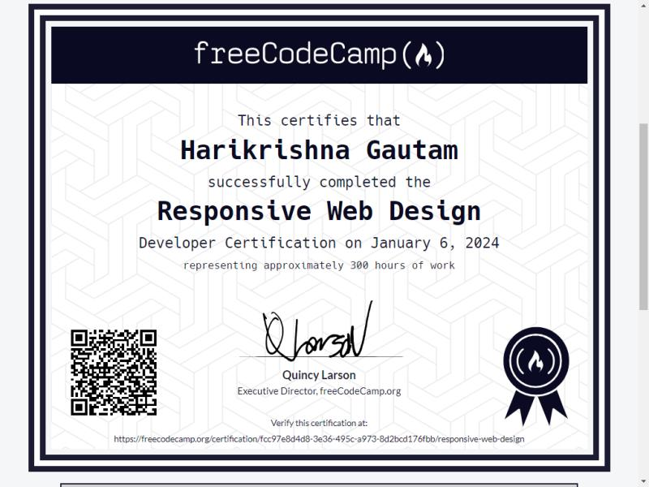

# Portfolio Website

This is the portfolio website of **Harikrishna Gautam**, showcasing skills, projects, certifications, and contact information.

## Table of Contents

- [About](#about)
- [Features](#features)
- [Technologies Used](#technologies-used)
- [File Structure](#file-structure)
- [How to Run](#how-to-run)
- [Screenshots](#screenshots)
- [Contact](#contact)

## About

This portfolio website is designed to highlight my journey as a Computer Science student and a passionate web developer. It includes sections for:

- **Home**: Introduction and navigation.
- **About Me**: A brief overview of my background and skills.
- **Certifications**: Display of certifications earned.
- **Education**: Academic qualifications.
- **Projects**: A showcase of my projects.
- **Contact Me**: A form to send messages and links to my social profiles.

## Features

- Responsive design for all devices.
- Typing animation for dynamic text.
- Interactive navigation menu.
- Organized sections for easy access to information.
- Downloadable CV button.

## Technologies Used

- **HTML5**: For structuring the content.
- **CSS3**: For styling and responsive design.
- **JavaScript**: For interactivity and animations.

## File Structure

## How to Run

1. Clone the repository or download the files.
2. Open `index.html` in any modern web browser.
3. Explore the website and its features.

## Screenshots

### Home Section

### About Me Section

### Certifications Section

### Projects Section

## Contact

Feel free to reach out via the contact form on the website or through the following platforms:

- **GitHub**: [github.com/your-profile](https://github.com/your-profile)
- **LinkedIn**: [linkedin.com/in/your-profile](https://linkedin.com/in/your-profile)
- **Facebook**: [facebook.com/your-profile](https://facebook.com/your-profile)
- **Email**: [example@gmail.com](mailto:example@gmail.com)

---

© 2025 Harikrishna Gautam | All Rights Reserved
